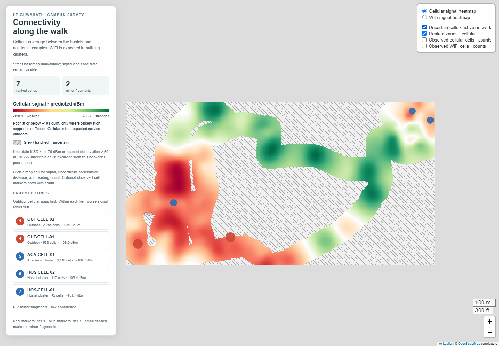
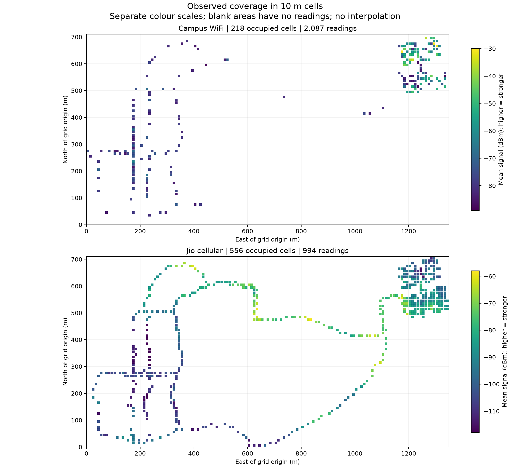
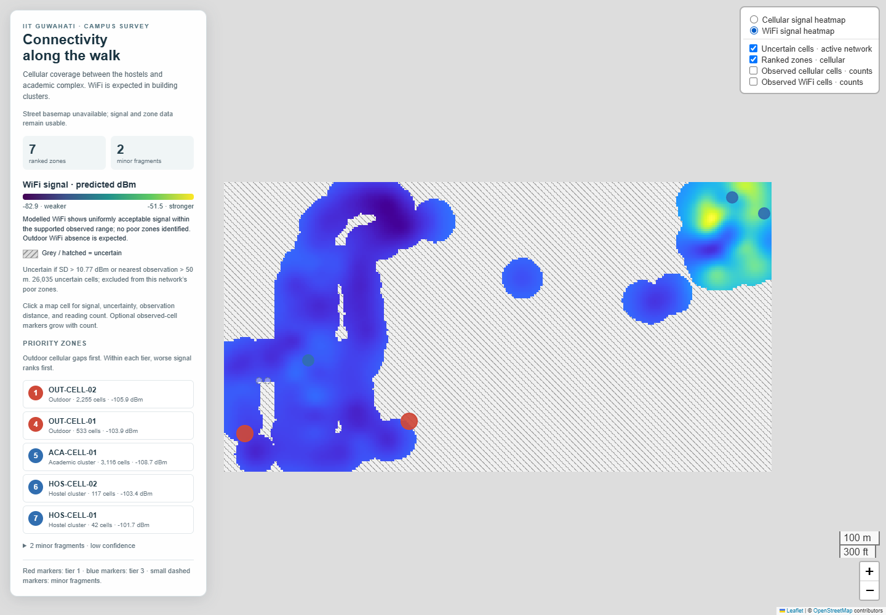

# IIT Guwahati WiFi + Cellular Dead-Zone Mapping

A walked wardriving survey maps real WiFi and cellular signal readings to identify weak-service zones across IIT Guwahati.



*Cellular coverage and ranked priorities. Hatched areas indicate uncertainty. The interactive HTML also includes campus streets and buildings.* [Explore the interactive map](outputs/maps/deadzone_map.html).

## Problem statement

This project addresses the absence of a walked connectivity survey for the surveyed IIT Guwahati routes. It maps WiFi and cellular signal along hostel and academic-complex walks to locate potential real-world dead zones and prioritize follow-up measurements.

## Dataset summary

- **3,081 real observed readings:** 2,087 WiFi readings via WiGLE and 994 cellular/Jio readings via Network Cell Info Lite.
- **100% real observations, 0% synthetic observations.** Interpolated predictions are stored separately and explicitly labelled predicted.
- **Project window: 2026-09-26/27**, across hostel and academic-complex routes at IIT Guwahati. All saved sensor timestamps fall on **2026-09-26**; the data does not establish a September 27 collection session.
- Campus WiFi includes `IITG_CONNECT` and `eduroam`. Collection limitations are recorded in [the collection log](docs/collection_log.md).

<details>
<summary>View the observed WiFi and cellular coverage</summary>



*Actual observations before interpolation: 218 occupied WiFi cells and 556 cellular cells. Blank areas have no readings; each network uses its own signal scale.*

</details>

## How to run

Use Python 3.13 and install the dependencies in a virtual environment:

```powershell
python -m venv .venv
.\.venv\Scripts\python.exe -m pip install -r requirements-dev.txt
```

The pipeline executes in this exact order:

1. `scripts/01_clean_merge.py` — clean sensor exports and merge observations using `data/raw/manifest.csv`.
2. `scripts/02_grid_binning.py` — aggregate observed readings into separate 10 m WiFi and cellular cells.
3. `scripts/03_interpolation.py` — fit count-aware Gaussian processes and predict signal and uncertainty on a 5 m grid.
4. `scripts/04_clustering_ranking.py` — classify supported poor cells, cluster adjacent cells, and rank zones by expected service and severity.
5. `scripts/05_visualization.py` — generate the interactive map with signal, uncertainty, and ranked-zone layers.

Run all five stages and the verification checks without overwriting the locked submission data:

```powershell
.\.venv\Scripts\python.exe -B scripts/dev/verify_submission.py
```

This command rebuilds in a temporary directory, compares every rebuilt Parquet table with the locked outputs, checks the submitted outputs and map, and verifies protected-file SHA-256 hashes. It leaves the historical master report `outputs/submission_checks.json` unchanged and prints the current check results. Browser checks require installed Brave, Chrome, or Edge and block external requests. Individual pipeline scripts write outputs beside their repository copy; run them directly only in a disposable copy.

Open `outputs/maps/deadzone_map.html` directly in Brave, Chrome, Edge, or VS Code's
browser. Campus streets, buildings, and labels are embedded alongside the survey
layers, so no web server or internet connection is needed. The survey panel can
be shown or hidden at desktop and mobile widths. The display-only OpenStreetMap
snapshot and its source/license details are in [data/context](data/context/README.md).

The embedded basemap covers only the campus survey area. Panning beyond it shows
an empty background; this version does not load a worldwide online map.
GitHub's file viewer displays the HTML source rather than running the map.
Clone or download the repository, then open `outputs/maps/deadzone_map.html`
locally. The preview images above and below can be viewed directly on GitHub.

## Key results

- **Campus WiFi: zero poor cells under the approved model rules**, consistent with solid coverage in supported areas where service is expected. Campus WiFi serves indoor building networks by design; outdoor corridor absence is expected. This is not independent confirmation of connection reliability.
- **Cellular: seven ranked poor zones across the surveyed routes:** four outdoor corridor zones, one academic zone, and two hostel zones. The highest-priority outdoor zone near the hostel exit averages approximately **−105.9 dBm**. The academic zone has the lowest zone mean overall, **−108.7 dBm**, but ranks below outdoor issues under the expected-service priorities.
- Poor zones are model classifications supported by nearby observations, not verified failed calls. Uncertain cells remain separate from rankings; see [the ranking method](docs/zone_ranking_methodology.md) and [model limitations](docs/interpolation_methodology.md).



*The WiFi view separates supported predictions from uncertain areas. The visible ranked markers still refer to cellular zones; no WiFi poor zones were identified under the approved rules.*

## Quick links

- [Dataset schema](docs/schema.md)
- [Ranked dead zones CSV](outputs/ranked_dead_zones.csv)
- [Interactive dead-zone map](outputs/maps/deadzone_map.html)
- [Map controls and verification](docs/map_documentation.md)

`data/processed/ranked_dead_zones.parquet` is the canonical ranking; `outputs/ranked_dead_zones.csv` is an independent human-readable export for judges. Development summaries and verification results are consolidated into the existing docs. Verification utilities are in `scripts/dev/`; required model artifacts, templates, and vendored map libraries/licenses are retained for reproducibility. PNG plots and map previews are in `outputs/plots/`; final check results and protected-file hashes are in `outputs/submission_checks.json`. `.venv/` is a local dependency environment excluded from the submission by `.gitignore`.

Built with assistance from GPT Astra for pipeline implementation.

